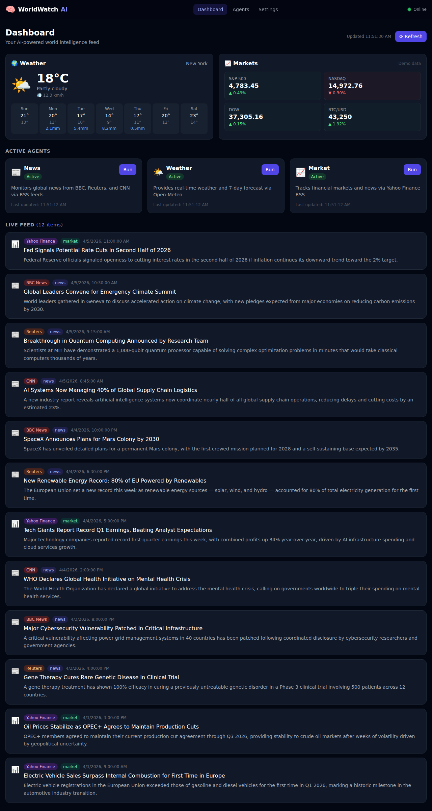
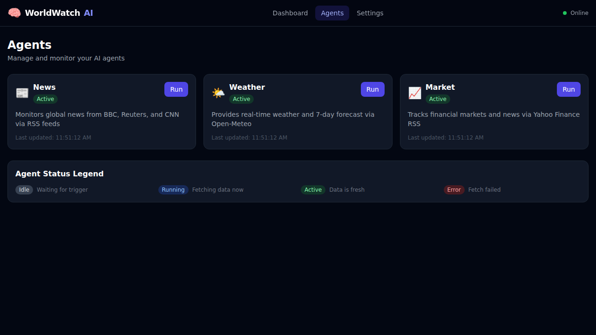
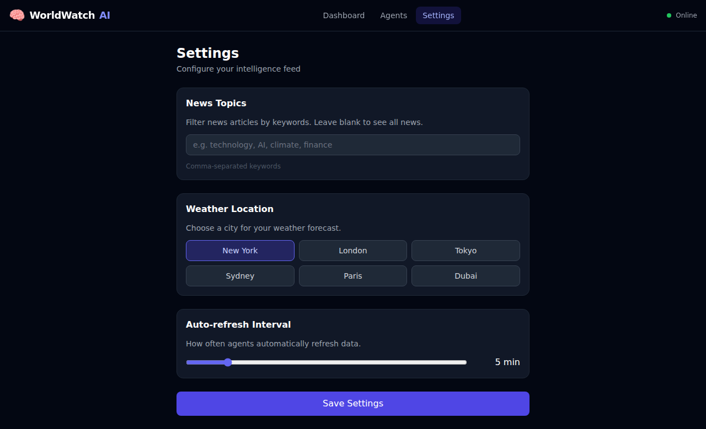

# WorldWatch AI — Multi-Agent Intelligence System

A modern full-stack web application that deploys multiple AI agents to continuously monitor the world for you — tracking global news, live weather, and financial markets in real time.

---

## 🌍 What It Does

**WorldWatch AI** orchestrates a team of specialized agents that independently gather intelligence from the web and surface it in a clean, unified dashboard:

| Agent | Data Source | Updates |
|-------|-------------|---------|
| 📰 **News Agent** | BBC News, Reuters, CNN (RSS) | Every 5 min |
| 🌤️ **Weather Agent** | Open-Meteo (free, no key) | Every 5 min |
| 📈 **Market Agent** | Yahoo Finance RSS | Every 5 min |

You can filter news by topic keywords, switch weather location, and manually trigger any agent at any time.

---

## 🏗️ Architecture

```
worldwatch-ai/
├── frontend/          # React 18 + TypeScript + Vite + TailwindCSS
│   ├── src/
│   │   ├── components/    # AgentCard, FeedItem, WeatherWidget, MarketWidget, Navbar
│   │   ├── pages/         # Dashboard, AgentsPage, ConfigPage
│   │   ├── hooks/         # useAgentData (data fetching + auto-refresh)
│   │   └── types/         # TypeScript interfaces
│   └── Dockerfile
├── backend/           # Python FastAPI multi-agent system
│   ├── agents/
│   │   ├── base_agent.py      # Abstract base class
│   │   ├── news_agent.py      # RSS news aggregator
│   │   ├── weather_agent.py   # Open-Meteo weather
│   │   ├── market_agent.py    # Yahoo Finance RSS + demo indices
│   │   └── agent_manager.py   # Orchestrator with background refresh
│   ├── api/routes.py          # REST API endpoints
│   ├── main.py                # FastAPI app + CORS + startup
│   └── Dockerfile
└── docker-compose.yml
```

---

## 🚀 Quick Start

### Option 1: Docker Compose (recommended)

```bash
docker-compose up --build
```

- **Frontend**: http://localhost:3000
- **Backend API**: http://localhost:8000
- **API Docs**: http://localhost:8000/docs

### Option 2: Manual Setup

**Backend**
```bash
cd backend
python -m venv .venv
source .venv/bin/activate       # Windows: .venv\Scripts\activate
pip install -r requirements.txt
uvicorn main:app --reload --port 8000
```

**Frontend**
```bash
cd frontend
npm install
npm run dev
```

Open http://localhost:5173

---

## 🔌 API Endpoints

| Method | Path | Description |
|--------|------|-------------|
| GET | `/api/agents` | List all agents with status |
| GET | `/api/agents/{name}/run` | Manually trigger an agent |
| GET | `/api/agents/{name}/results` | Get results for an agent |
| GET | `/api/feed` | Combined news + market feed |
| GET | `/api/weather` | Current weather + 7-day forecast |
| GET | `/api/status` | System overview |
| GET | `/api/config` | Get user configuration |
| POST | `/api/config` | Update topics / location / interval |

---

## 🛠️ Tech Stack

### Frontend
- **React 18** + **TypeScript**
- **Vite** (build tool)
- **TailwindCSS** (dark-theme UI)
- **React Router v6**
- **Axios** (HTTP client)

### Backend
- **Python 3.11** + **FastAPI**
- **Uvicorn** (ASGI server)
- **feedparser** (RSS parsing)
- **httpx** (async HTTP)
- **Pydantic v2** (data validation)

### Infrastructure
- **Docker** + **Docker Compose**
- **Nginx** (static file serving + API proxy)

---

## 📸 Screenshots

### Dashboard — Weather, Markets, Agent Status & Live Feed


### Agents — Status & Manual Control


### Settings — Topics, Location & Refresh Interval


---

## 📄 License

MIT
